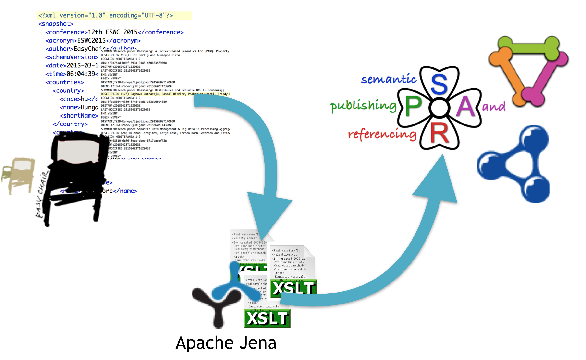

# cLODg - conference Linked Open Data generator

cLODg implements a methodology to produce Linked Data to describe a scientific conference and its publications, participants and events.

The workflow sketched below consists of:

1. [Data acquisition](#data-acquisition)
2. [Data conversion](#data-conversion)
3. [Data augmentation and verification](#data-augmentation-and-verification)
4. [Linked Data Publication](#linked-data-publication)

## Data acquisition
Data is collected from:
- easychair output (the [schema](./resources/conference_dump.xml) of produced output has been kindly provided by [EasyChair](https://www.easychair.org)
- csv from the satellite events organizers
- csv describing calendars...

## Data conversion

### Ontologies

We use the following vocabularies:
- http://data.semanticweb.org/ ontology
- 

### Conversion tools

## Data augmentation and verification

We implemented a Web based application to collect user feedback...

## Linked Data Publication

- sending data to http://data.semanticweb.org
